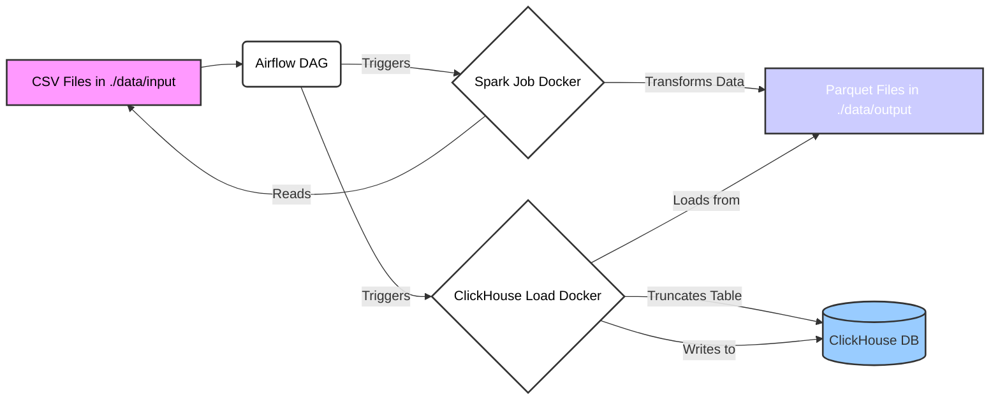

# IoT Data Processing Pipeline with Spark, Airflow, and ClickHouse

[](https://www.python.org/)
[](https://spark.apache.org/)
[](https://airflow.apache.org/)
[](https://clickhouse.com/)
[](https://www.docker.com/)
[](https://opensource.org/licenses/MIT)
[](https://www.repostatus.org/#active)
[](https://github.com/0x22B9/iot_data_pipeline/issues)
[](https://github.com/0x22B9/iot_data_pipeline/network)
[](https://github.com/0x22B9/iot_data_pipeline/stargazers)

This project demonstrates an end-to-end data pipeline for processing large IoT datasets. It utilizes Apache Spark for distributed data transformation, Apache Airflow for workflow orchestration, ClickHouse as a fast analytical data store, and Docker for containerization.

The pipeline reads multiple CSV files containing IoT network connection data from the IoT-23 dataset, performs transformations (like parsing timestamps, cleaning column names, casting types), saves the processed data into Parquet format, and finally loads this data efficiently into a ClickHouse table.

## Architecture Overview

1.  **Data Ingestion:** Raw `.csv` files are placed in a designated input directory (`data/input/`).
2.  **Orchestration:** Apache Airflow runs a DAG (`iot_data_processing_pipeline_parquet`) defined in `dags/`.
3.  **Spark Processing:** The Airflow DAG triggers a Spark job (`src/jobs/process_iot_data.py`) running inside a dedicated Docker container (`iot_spark_container`).
    *   Spark runs in **`local[*]` mode**, meaning it utilizes all available CPU cores allocated to its Docker container on the single host machine. It does *not* run as a distributed cluster.
    *   Spark reads all `.csv` files from the input directory.
    *   Applies transformations (schema enforcement, column renaming, data type conversion, timestamp parsing).
    *   Writes the transformed data to a Parquet file directory (`data/output/iot_parquet/`) shared via Docker volumes.
4.  **Data Loading:** The Airflow DAG then triggers a command inside the ClickHouse container (`iot_clickhouse_server`).
    *   First, it truncates the target ClickHouse table (`default.iot_data`) to ensure idempotency for the load step.
    *   Then, it uses ClickHouse's `INSERT INTO ... SELECT FROM file(...)` function to efficiently load data directly from the Parquet files written by Spark.
5.  **Supporting Services:**
    *   **PostgreSQL:** Used as the metadata database for Airflow.
    *   **Docker:** All services (Airflow Webserver/Scheduler, Spark application base, ClickHouse, PostgreSQL) run in separate Docker containers managed by Docker Compose.



## Dataset: IoT-23

This project utilizes the **IoT-23 dataset**, a collection of network traffic captures from Internet of Things (IoT) devices, first published in January 2020 by the Stratosphere Laboratory, AIC group, FEL, CTU University, Czech Republic. The research and dataset creation were funded by Avast Software, Prague.

*   **Purpose:** To provide a large, labeled dataset of real IoT malware infections and benign traffic for developing and testing machine learning algorithms, particularly for security applications.
*   **Content:** The dataset consists of 23 captures (scenarios):
    *   **20 Malicious Scenarios:** Network traffic (pcap files, converted to CSV for this project) captured from a Raspberry Pi infected with specific malware samples (e.g., Mirai, Okiru, Torii). Each scenario executed different malware actions and used various protocols.
    *   **3 Benign Scenarios:** Network traffic captured from real, non-infected IoT devices: a Philips HUE smart LED lamp, an Amazon Echo home assistant, and a Somfy smart doorlock.
*   **Environment:** Both malicious and benign scenarios were captured in a controlled network environment with internet access, simulating real-world conditions.
*   **Labels:** The dataset includes detailed labels assigned based on manual network analysis, providing ground truth for traffic classification.

### Dataset Labels Explained

The `label` and `detailed-label` columns in the dataset provide classifications for network flows:

*   **`Benign`**: Indicates normal traffic with no suspicious or malicious activities detected.
*   **`Malicious`**: A general category for flows associated with malware activity. The `detailed-label` provides specifics:
    *   **`Attack`**: Flows identified as attempts to exploit vulnerabilities in other hosts (e.g., telnet brute-force, command injection).
    *   **`C&C`** (Command & Control): Flows indicating communication between the infected device and a C&C server (e.g., periodic connections, downloading binaries, receiving commands).
    *   **`DDoS`** (Distributed Denial of Service): Flows identified as part of a DDoS attack launched by the infected device (often characterized by a high volume of flows to a single target).
    *   **`FileDownload`**: Flows where a file is being downloaded to the infected device (often detected by response size, suspicious source IP/port).
    *   **`HeartBeat`**: Small, periodic packets sent to keep the C&C server aware of the infected host's status.
    *   **`Mirai`**: Flows exhibiting characteristics typical of the Mirai botnet family.
    *   **`Okiru`**: Flows exhibiting characteristics typical of the Okiru botnet family (less common than Mirai).
    *   **`PartOfAHorizontalPortScan`**: Flows used for scanning multiple IP addresses on the same port, likely to gather information for future attacks.
    *   **`Torii`**: Flows exhibiting characteristics typical of the Torii botnet family (less common than Mirai).

*(Label descriptions adapted from the IoT-23 dataset documentation.)*

## Technology Stack

*   **Processing:** Apache Spark 3.5.5 (via PySpark)
*   **Orchestration:** Apache Airflow 2.9.1
*   **Database:** ClickHouse (Latest)
*   **Metadata DB (Airflow):** PostgreSQL 17
*   **Containerization:** Docker & Docker Compose
*   **Language:** Python 3
*   **Data Format:** CSV (Input), Parquet (Intermediate)
*   **Libraries:** `pyspark`, `pyarrow`, `apache-airflow`, `apache-airflow-providers-docker`, `apache-airflow-providers-postgres`, `pyyaml`, `docker`

## Prerequisites

*   **Docker:** Ensure Docker Desktop (or Docker Engine + Docker Compose) is installed and running. ([Install Docker](https://docs.docker.com/get-docker/))
*   **Git:** Required for cloning the repository. ([Install Git](https://git-scm.com/book/en/v2/Getting-Started-Installing-Git))
*   **Internet Connection:** Needed to download Docker images, dataset, and JDBC driver.
*   **Disk Space:** At least 50-60 GB free space recommended for the dataset (~39 GB), Docker images, database volumes, and intermediate Parquet files.
*   **RAM:** 8GB+ RAM recommended, ideally 16GB+ for smoother Spark execution with a large dataset.

## Setup Instructions

1.  **Clone the Repository:**
    ```bash
    git clone https://github.com/0x22B9/iot_data_pipeline
    cd iot_data_pipeline
    ```

2.  **Download IoT Dataset:**
    *   Download the IoT-23 dataset from Kaggle: [Dataset](https://www.kaggle.com/datasets/indominousx86/iot-23-dataset-for-multiclass-classification)
    *   Extract the archive.
    *   Place **all** the `.csv` files (e.g., `Malware-Capture-33-1.csv`, `Malware-Capture-1-1.csv`, etc.) into the `data/input/` directory within the project structure.
    *   **Note:** The `data/` directory is listed in `.gitignore` and its contents are **not** tracked by Git. You must manually place the files here.

3.  **Download ClickHouse JDBC Driver:**
    *   Go to the ClickHouse JDBC Driver releases page: [Clickhouse JDBC Releases](https://github.com/ClickHouse/clickhouse-jdbc/releases)
    *   Download the `-all.jar` file for a recent stable version (this project was tested with `v0.8.4`). The required file is `clickhouse-jdbc-0.8.4-all.jar`.
    *   Place the downloaded `.jar` file into the `jars/` directory within the project structure.
    *   **Note:** The `jars/` directory is listed in `.gitignore` and its contents are **not** tracked by Git. You must manually place the file here. If you use a different version, update the filename references in `src/config/config.yaml` (`paths.jdbc_driver_path`) and `dags/iot_processing_dag.py` (`SPARK_JAR_PATH_IN_CONTAINER`).

4.  **Configure Environment (`.env.airflow`):**
    *   This file stores configuration and secrets needed by Docker Compose and potentially Airflow. It is **required** for the setup to work.
    *   **Create** a file named `.env.airflow` in the project root.
    *   Copy the following content into `.env.airflow`, **adjusting the values** as needed:

        ```dotenv
        # --- Airflow Core Settings ---
        AIRFLOW_UID=50000 # User ID for Airflow processes inside containers. Default 50000 usually works.

        # --- Airflow Database (PostgreSQL) ---
        AIRFLOW_DB_USER=airflow
        AIRFLOW_DB_PASSWORD=airflow # Change this for better security if desired
        AIRFLOW_DB_NAME=airflow
        AIRFLOW__DATABASE__SQL_ALCHEMY_CONN=postgresql+psycopg2://${AIRFLOW_DB_USER:-airflow}:${AIRFLOW_DB_PASSWORD:-airflow}@postgres:5432/${AIRFLOW_DB_NAME:-airflow}

        # --- Airflow Executor ---
        AIRFLOW__CORE__EXECUTOR=LocalExecutor

        # --- Airflow Webserver UI Login ---
        AIRFLOW_UID_AUTH=admin # Username for Airflow UI
        AIRFLOW_PWD=admin    # Password for Airflow UI - CHANGE THIS!

        # --- IMPORTANT: Path for Volume Mounts ---
        # Absolute path to *this project's root directory* on your HOST machine.
        # USE FORWARD SLASHES (/) even on Windows.
        # Example Windows: HOST_PROJECT_PATH=C:/Users/YourUser/Projects/iot_data_pipeline
        # Example Linux/MacOS: HOST_PROJECT_PATH=/home/youruser/projects/iot_data_pipeline
        HOST_PROJECT_PATH=C:/your/path/to/iot_data_pipeline

        # --- Airflow Security ---
        # Generate a strong, random secret key. Example: openssl rand -hex 30
        AIRFLOW__WEBSERVER__SECRET_KEY=your_very_secret_key_here
        ```
    *   **CRITICAL:**
        *   Set `HOST_PROJECT_PATH` to the correct **absolute path** of the cloned project directory on your machine. Use forward slashes (`/`). This is needed for the DAG to correctly mount volumes into the DockerOperator.
        *   Set `AIRFLOW__WEBSERVER__SECRET_KEY` to a **strong, random string**.
        *   Change the default `AIRFLOW_PWD` for security.
    *   **SECURITY:** This `.env.airflow` file is listed in `.gitignore`. **NEVER COMMIT THIS FILE** to version control if it contains sensitive information.

5.  **Configure Airflow Variables:**
    *   These variables are used by the DAG to securely access credentials and configuration without hardcoding them.
    *   Once Airflow is running (after `docker-compose up`), access the Airflow UI (`http://localhost:8080`).
    *   Log in using the credentials defined in `.env.airflow` (`AIRFLOW_UID_AUTH` / `AIRFLOW_PWD`).
    *   Navigate to `Admin` -> `Variables`.
    *   Create the following Variables (**Key** -> **Val**):
        *   `iot_ch_user` -> `spark_user` (The user Spark connects as, and used for loading)
        *   `iot_ch_password` -> `YourSecurePassword` ( **IMPORTANT:** This **must match** the password defined for `spark_user` in ClickHouse. See `clickhouse_scripts/init_db.sql`. Mark this as "Secret" in the Airflow UI.)
        *   `iot_ch_db` -> `default` (The ClickHouse database name)
        *   `iot_ch_table` -> `iot_data` (The ClickHouse table name)
        *   `iot_ch_container_name` -> `iot_clickhouse_server` (The docker-compose service name for ClickHouse)
        *   `iot_spark_container_name` -> `iot_spark_container` (The docker-compose service name for the Spark base container)
        *   `iot_spark_parquet_dir_in_spark` -> `/app/data/output/iot_parquet` (Path inside Spark container where Parquet is written)
        *   `iot_ch_parquet_dir_in_ch` -> `/var/lib/clickhouse/user_files/pipeline_data/output/iot_parquet` (The *same* Parquet directory, but accessed from *within* the ClickHouse container via its volume mount)

6.  **Initial ClickHouse Setup (Automatic):**
    *   The file `clickhouse_scripts/init_db.sql` contains commands to create the `spark_user` (with the password `YourSecurePassword`) and the target `iot_data` table.
    *   This script will automatically run the *first time* the `clickhouse-server` container starts with an empty `clickhouse_data` volume (i.e., on the very first `docker-compose up`, or after `docker-compose down -v`).
    *   **Verify:** Ensure the password you set in the `iot_ch_password` Airflow Variable matches the password in `clickhouse_scripts/init_db.sql` (`YourSecurePassword` by default). If you change the password in the SQL file, update the Airflow Variable accordingly.

## Running the Pipeline

1.  **Start All Services:** Open a terminal in the project root directory and run:
    ```bash
    docker-compose up --build -d
    ```
    *   `--build`: Rebuilds the `spark-app` image if `Dockerfile` or related files changed.
    *   `-d`: Runs containers in detached mode (in the background).
    *   The first launch might take some time to download images and initialize the Airflow database. Monitor progress with `docker-compose logs -f airflow-init` and then `docker-compose logs -f airflow-scheduler`.

2.  **Access Airflow UI:**
    *   Open your web browser and navigate to `http://localhost:8080`.
    *   Log in with the Airflow UI credentials specified in `.env.airflow` (default: `admin`/`admin`, but you should change the password).

3.  **Activate and Trigger the DAG:**
    *   Find the DAG named `iot_data_processing_pipeline_parquet` in the Airflow UI.
    *   Toggle the switch on the left to activate it (unpause).
    *   Click the "Play" (▶️) button on the right side of the DAG row, then click `Trigger DAG`.

4.  **Monitor Execution:**
    *   Click on the DAG name to view its runs.
    *   Go to the `Grid` or `Graph` view to see the tasks running.
    *   You can view logs for each task by clicking on the task instance square and selecting `Log`.
    *   The `run_spark_to_parquet_job` task will take the longest (approx. 15-20 minutes depending on your hardware and resources allocated to Docker). Since it runs in `local[*]` mode, its performance is directly tied to the CPU and memory available to the `iot_spark_container`.

## Accessing Services

*   **Airflow UI:** `http://localhost:8080`
*   **Spark UI:** `http://localhost:4040` ( **Note:** Only accessible *while* the `run_spark_to_parquet_job` task is actively running. Provides insights into Spark stages, tasks, and resource usage within the `local[*]` execution).
*   **ClickHouse Client (CLI):**
    ```bash
    docker exec -it iot_clickhouse_server clickhouse-client --user spark_user --password YourSecurePassword
    # Or using the default user if needed for admin tasks:
    # docker exec -it iot_clickhouse_server clickhouse-client
    ```
    Inside the client, you can run SQL queries like `SHOW TABLES;`, `SELECT count(*) FROM default.iot_data;`, `DESCRIBE TABLE default.iot_data;`.

## Stopping the Environment

To stop all running containers and remove the network:

```bash
docker-compose down
```

To stop containers AND remove associated volumes (including PostgreSQL metadata and ClickHouse data - **use with caution** as data will be lost):

```bash
docker-compose down -v
```

## Project Structure

```
iot_data_pipeline/
├── dags/                     # Airflow DAG definitions
│   └── iot_processing_dag.py
├── clickhouse_scripts/       # ClickHouse initialization scripts
│   └── init_db.sql
├── src/                      # PySpark application source code
│   ├── __init__.py
│   ├── jobs/                 # Spark job scripts
│   │   ├── __init__.py
│   │   └── process_iot_data.py
│   ├── utils/                # Utility functions (if any)
│   │   └── __init__.py
│   └── config/               # Configuration files
│       └── config.yaml
├── data/                     # Data files (NOT tracked by Git)
│   ├── input/                # Raw CSV files (Place downloaded data here)
│   └── output/               # Output Parquet files (Generated by Spark)
│       └── iot_parquet/
├── tests/                    # Unit/Integration tests (TODO)
│   └── ...
├── jars/                     # JDBC drivers, etc. (NOT tracked by Git)
│   └── clickhouse-jdbc-0.8.4-all.jar # Place downloaded driver here
├── logs/                     # Airflow logs volume mount
├── plugins/                  # Airflow plugins volume mount
├── config/                   # Airflow configuration volume mount (e.g., airflow.cfg)
├── Dockerfile                # Dockerfile for the Spark application base image
├── docker-compose.yml        # Docker Compose configuration for all services
├── requirements.txt          # Python dependencies for Spark image
├── .dockerignore             # Files to ignore during Docker build context
├── .gitignore                # Files/directories to ignore for Git
├── .env.airflow.example      # Example environment file (optional, or use README)
└── README.md                 # This file
```

## Performance Considerations

*   **Spark `local[*]` Mode:** The Spark job currently runs in `local[*]` mode (configured in `src/config/config.yaml` and used in the DAG's `spark-submit` command). This means Spark runs entirely within a single container, using all available CPU cores allocated to that container by Docker.
    *   **Pros:** Simplifies setup for local development; no need for a cluster manager.
    *   **Cons:** Performance is limited by the resources (CPU, RAM) of the single host machine and the Docker container limits. Does not scale beyond one machine.
    *   **Tuning:** You can adjust the memory allocated to the Spark driver via `spark.driver_memory` in `config.yaml` and potentially adjust Docker Desktop's overall resource limits (RAM, CPU cores) for better performance.
*   **ClickHouse Load:** Loading data from Parquet using `INSERT INTO ... SELECT FROM file()` is significantly faster than row-by-row JDBC insertion.
*   **Resource Allocation:** Ensure Docker has sufficient resources (CPU cores, Memory) allocated in Docker Desktop settings, especially when processing the full 39GB dataset.

## Security Notes

*   **`.env.airflow`:** This file contains sensitive information (passwords, secret keys) and environment-specific paths (`HOST_PROJECT_PATH`). It is **critical** that this file is included in `.gitignore` and **never committed** to version control.
*   **Passwords:**
    *   The default ClickHouse password (`YourSecurePassword`) is visible in `clickhouse_scripts/init_db.sql`. Ensure the `iot_ch_password` variable in Airflow matches this value. Change this default password in a production or shared environment.
    *   Change the default Airflow UI password (`admin`) in `.env.airflow`.
*   **Airflow Variables:** Use Airflow Variables (set via UI or CLI) for storing credentials and sensitive configuration used within DAGs, as demonstrated for ClickHouse connection details.

## License

See the [LICENSE](LICENSE) file for details.